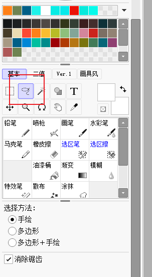

# sai基本操作  

[SAI2教程](https://www.bilibili.com/video/BV1Jh4y187TN)

## 视图与浮动视图  

菜单栏 - 视图 - 新建视图 / 新建浮动视图  

## 保存文件格式  

## 图层  

加入文本、图片、表格、插件  

顺序代表处于顶层或底层  

## 钢笔功能  

创建一个新钢笔图层  

程序会为线条插值获得锚点，编辑路径与移动锚点等  

> 折线绘制中按<kbd>Enter</kbd>结束绘制  

钢笔图层中不能使用其他笔刷  

## 如何绘制水平线、竖直线与45°线等固定角度直线  

- 利用 尺子 - 直线 工具  

按住<kbd>Alt</kbd>可以旋转尺子，按住<kbd>Shift</kbd>确保尺子水平、竖直或45°  
按住<kbd>Ctrl</kbd>可以移动尺子  
拉动压感笔，与平常使用直尺体验相同  

- 直线绘图模式  

按住<kbd>Shift</kbd>确保直线水平、竖直或45°  

- 使用<kbd>Shift</kbd>键  
先用画笔点一下，确定起点，随后按住<kbd>Shift</kbd>确保直线，挪动画笔到终点，轻轻点击完成绘制  

## 透视变换  

<kbd>Ctrl</kbd><kbd>T</kbd>实现透视变换  

## 快捷键设置  

TODO  

## 画笔参数调整  

按住<kbd>Ctrl</kbd><kbd>Alt</kbd>，会在光标处弹出调整画笔大小和画笔浓度的框  
此时按住压感笔并移动，可以动态调整画笔大小  

- 正常 / 正片叠底：颜色是否叠加  
- 画笔轮廓的聚散程度  
- 画笔大小（最下方亦同）  
- 最小大小：画笔粗细变化时的最细有多细  
- 画笔浓度与最小浓度  
- 画笔类型与纸张质感？  

> 其他画笔拥有更多的可定义参数  

## 透视工具  

首先新建图层，再新建透视尺或透视网格  

按住<kbd>Ctrl</kbd>可以移动透视尺  

## 喷枪  

环境色、层次感、表现光影  

## 涂抹  

涂抹已有的部分(晕染、稀释、延伸)  

## 套索  

- 绘制形状、填充  
- 选取区域、移动/复制  
- 自定义形状的擦除（橡皮擦一般是圆边的）  

按<kbd>Shift</kbd>修改范围  

## 魔法棒  

本质是一个选区工具  
- 选取后选择油漆桶进行上色  
- 限定画笔的作用范围  
- 按<kbd>Ctrl</kbd><kbd>D</kbd>取消选区  

> 注意**选取取样模式**  

## 剪贴蒙版  

创建/修改一个图层，让下一图层的非透明区域限定本图层的可见部分  

## 图层蒙版  

针对某个图层，设定单通道黑白灰图，与图层内容相乘  

## 高斯模糊  

作用：模糊近景，突出中景  

> 可以结合调整不透明度  

## 锁定透明像素  

作用：绘制不会作用于透明像素  

## 色调调整  

- 勾选着色，相当于是将原图单通道黑白灰化，再乘以所选HSV颜色  

