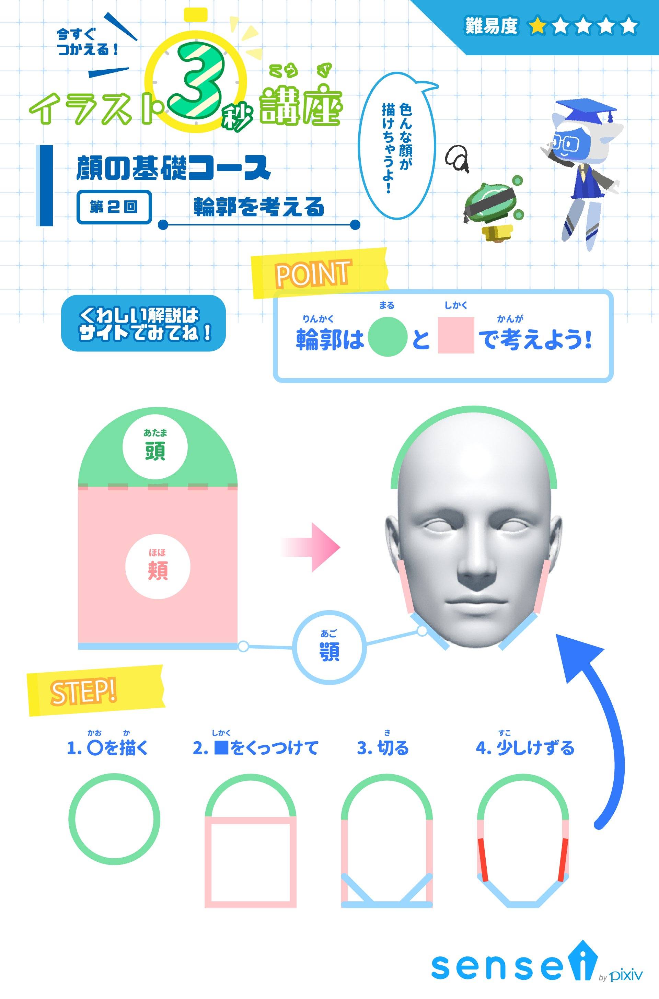
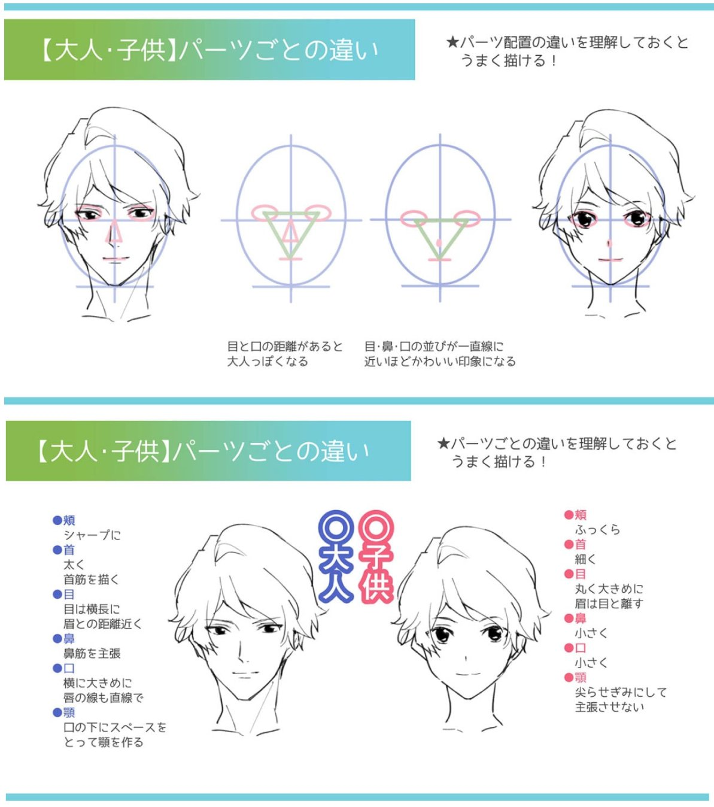

# 临摹阶段  

简笔画/线稿 ≈ 线条 + 抓型 + 一些透视  
> 注意：视觉上给人的感受为先，符合实际为次要  

## SAI2相关基本操作  

1. 折线绘制：<kbd>Enter</kbd>结束绘制  
2. 直线绘制的方式  
    1. 尺子（<kbd>Ctrl</kbd>移动、<kbd>Alt</kbd>旋转、<kbd>Shift</kbd>固定水平竖直45°）  
    2. 直线绘图模式  
    3. 按住<kbd>Shift</kbd>键  
3. 透视变换<kbd>Ctrl</kbd><kbd>T</kbd>  
4. 画笔  
    - <kbd>Ctrl</kbd><kbd>Alt</kbd>：拉动光标，调整画笔粗细  
    - 其他相关参数  

## 线条练习的要求  

目的：练手、练手感，形成肌肉记忆  

要求：  

1. 流畅  
    - 一气呵成，不要接线、不要有回钩  
    - 勿快勿慢，保持线条匀称  
2. 准  
    - 型准，符合客观事物的空间结构  
    - 线条闭合要好  
3. 粗细得当  
    - 区分内外轮廓线，有空间感与层次感  

手段：  
- 有意识调整画笔粗细  
- 自由调整画布大小、位置与角度（主要目的是方便自己的右手）  

## 临摹与抓型  

目的：练习眼力；理解他人画作的结构，形成自己的抓型方法  

思路：  

1. 抓型本质是对角度、长度、位置的感知  
2. 辅助线  
    - 宁方勿圆，用简单的多边形框住目标  
    - 粗略的辅助线即可，无需精确框住目标  
    - 可以采用九宫格或米字格等，但不要过于依赖（尤其是依赖精细的网格）
3. 用眼分辨线条的起点和终点（而不是直接去贴合线条的走向）  
    > 会产生交叉的线条，用橡皮擦擦除多余的线头  
4. 摹后尝试临，临时注意对比自己与原画的差距(这是一个反复的过程)  
    - 如哪些部位大小、位置、角度不准等  

## 临摹过程示例  

From:  
[【什么是临摹】一起聊聊绘画中的临摹技巧](https://zhuanlan.zhihu.com/p/31334302)

## 面部表情+头肩颈参考  

From: *pixivsensei*  

---

<u>正脸结构</u>

---

<u>正脸结构的简单抽象</u>

---

<u>正脸辅助线</u>

---

<u>半侧面脸结构</u>

---

<u>侧脸结构</u>

---

<u>侧脸口鼻角度</u>

---

<u>不同角度的头与辅助线</u>

---

<u>三种眼睛类型</u>

---

<u>头颈肩比例</u>

## 面部表情+头肩颈参考2  

From: *palmie*  

### 卡通 vs. 现实  

### 头颈肩关系  

<u>头颈肩比例</u>

<u>头肩颈比例与辅助线</u>

<u>头肩颈比例：线稿与辅助线</u>

---

<u>头颈位置关系及其中线</u>

---

<u>眼耳位置关系变化</u>

---

<u>头部要有立体感</u>

### 女性头部  

<u>不同角度的女性头部</u>

---

<u>女性头部-正面1</u>

<u>女性头部-正面2</u>

<u>女性头部-侧面</u>

---

<u>女性头部-半侧面1</u>

<u>女性头部-半侧面2</u>

<u>女性头部-半侧面3</u>

### 男性头部  

<u>不同角度的男性头部</u>

<u>不同年龄的男性头部</u>

---

<u>男性头部-正面1</u>

<u>男性头部-正面2</u>

<u>男性头部-正面3</u>

---

<u>男性头部-侧面</u>

---

<u>男性头部-所有要素</u>

<u>男性女性头部对比</u>

### 眼睛  

<u>不同的眼睛类型</u>

---

<u>双眼的平行辅助线</u>

---

<u>不同角度的眼睛</u>

### 发型  

<u>不同年龄性格角色的发型与面部线条</u>

---

<u>正面头发的画法</u>

**头发画法：分块的方式**  

### 表情  

<u>正面</u>

<u>左侧</u>

<u>左上</u>

<u>左下</u>

---

<u>睡颜</u>

## 面部与五官辅助线  

From:  
[【五官画法】 1. 五官定位](https://www.bilibili.com/video/BV1Jh4y187TN?p=31)

<u>三庭</u>

<u>脸的大致轮廓与五官十字线</u>

<u>五官线稿</u>

## 可参考书目  

[《伯里曼人体结构绘画教学》](https://natescarlet.github.io/bridgman)
