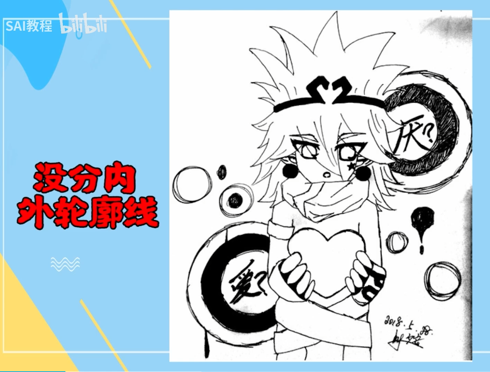
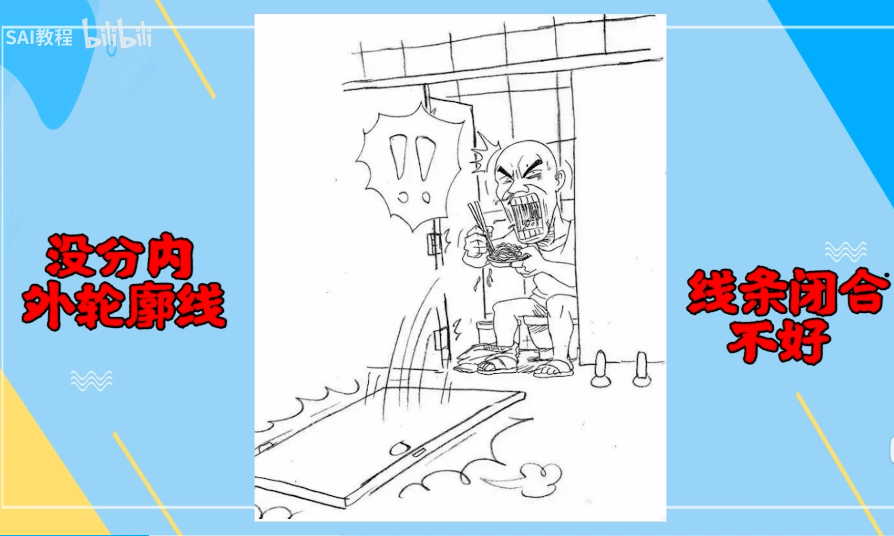
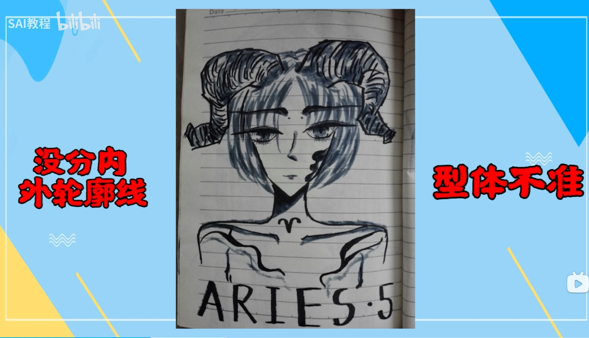

# 线条练习  

1. 排线  
2. 定点连线（多边形、有弧度的曲线）  
3. 临摹  

## 羊老师语  

要一气呵成：  
- **不要接线**，一条线别反复画，一笔没画好撤回就行了  
    - 比如画一半断了，不想撤回就接上了；一般新手接线很难看  

注意：  
1. 不要两头轻中间重，保持匀称  
2. 别有回笔，别有小倒钩，不要拉丝  
3. 别太慢：手抖  
4. 别太快：控制不了线条，白练  

各种线条画法：  
- 短线：以小拇指第二关节为轴心  
- 中长线：以手腕为轴心  
- 长线：锁手腕，用手臂  

画线 -> 找型 -> 透视 -> 构成 -> 色彩  

### 抓型  

1. 打辅助线：九宫格、米字格  
2. 宁方勿圆：辅助线上、具体的线条上  
    - 形要基本归纳成多边形  

## 我哥语  

描线的目的是  
1. 练习手感，不要哆哆嗦嗦画线段  
2. 分析画师笔触，卡结构的地方粗一些，线条轻重处理  
3. 学习人家形体归纳方法，五官头发这些的小细节  

准、流畅、粗细，都要兼顾  
可以随意调整画布大小位置角度，记得调整画笔大小  

## 误区  

1. 不分内外轮廓线 -> 没立体感 （练分级）  

2. 线条闭合不好，线条不流畅  

3. 型体不佳 （练眼力）  

- 少用撤回和橡皮擦（对自己要求高一些）  

## 临摹  

1. 用眼分辨线条的起点和终点  
2. 交叉的线头用橡皮擦仔细擦掉  

- 有意训练从各个角度画线  

## 造型准确  

- 对比：角度、长度  
- 内容：外轮廓、内结构、可选细节  
    - 粗细：5/3/1个像素  
    - 占比：20/70/10%  

1. 粗略的外轮廓辅助线  
    - 形状比较简单  
    - 不一定完全框住对象  
2. 进一步分解对象  
    - 分解为几个部分 -> 定点、连线  
    - 从外轮廓到内轮廓逐步地画  
    - *内部线条随意添加*  

(原来这个地方是这样画的)  
在练习中，揣摩各种对象（比如衣物、头发、手臂等等）的勾线方法  

